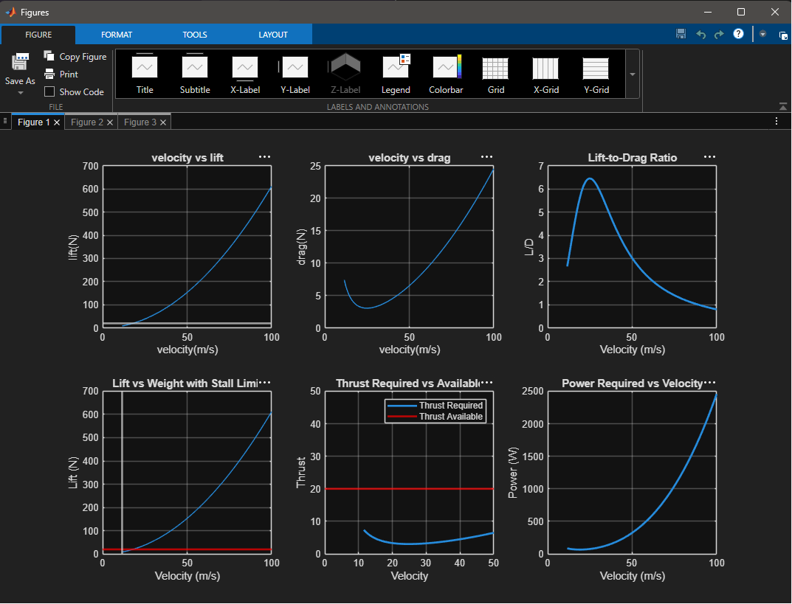
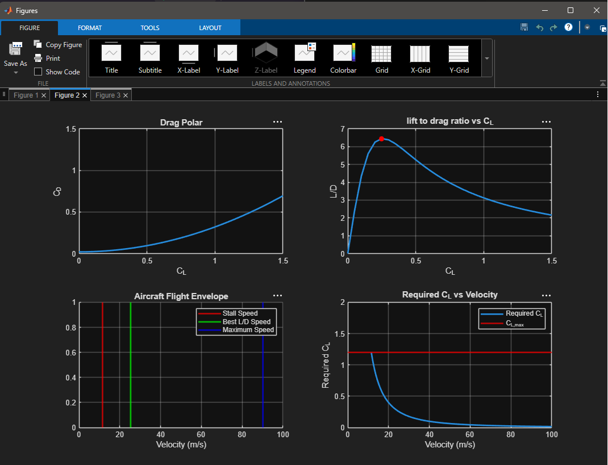
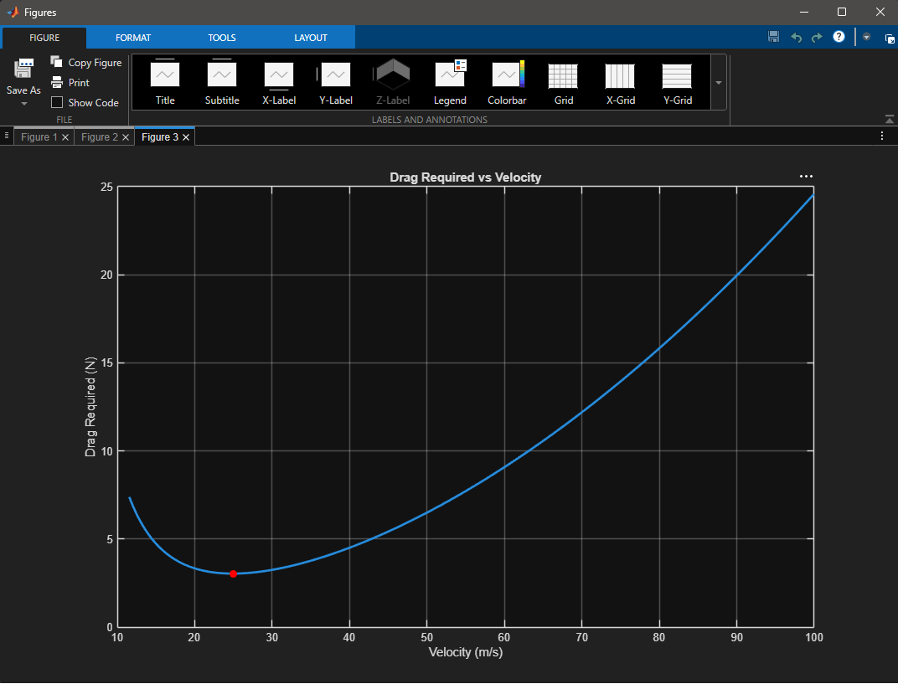

# aircraft-performance-simulation
MATLAB-based aircraft performance simulation project
# Aircraft Performance Simulation Using MATLAB

## Overview

This project simulates aircraft aerodynamic and performance characteristics using MATLAB.

The simulation analyzes lift, drag, thrust required, power required, stall speed, maximum speed, maximum lift-to-drag ratio, minimum drag speed, and flight envelope characteristics.

## Features

* Lift and Drag Analysis
* Stall Speed Estimation
* Maximum Speed Estimation
* Drag Polar
* Flight Envelope Visualization
* Maximum L/D Analysis
* Minimum Drag Speed Calculation
* Thrust Required Analysis
* Power Required Analysis

## Results

### Performance Plots

### Flight Envelope

### Drag Polar

## Software Used

* MATLAB

## Author

Sornalakshmi Senthilkumar

B.Tech Aerospace Engineering

Shanmugha Arts,Science,Technology & Research Academy, Thanjavur.
